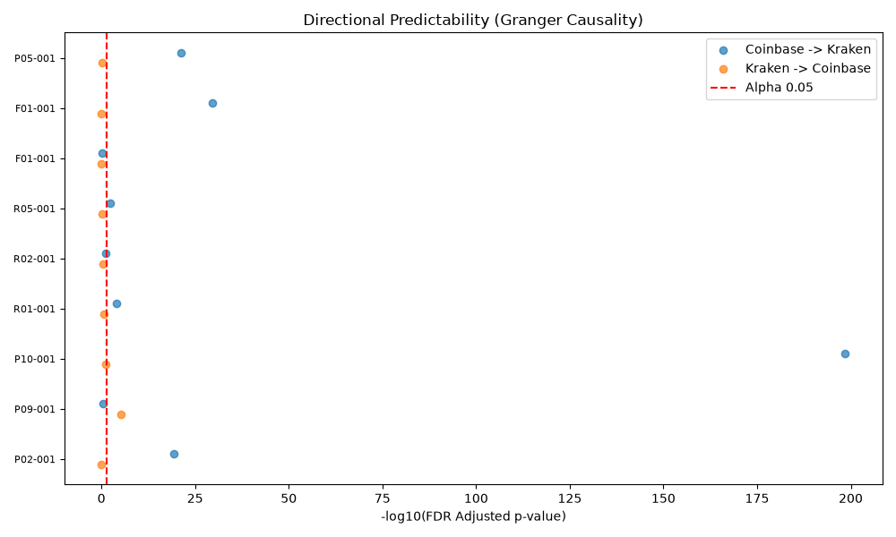
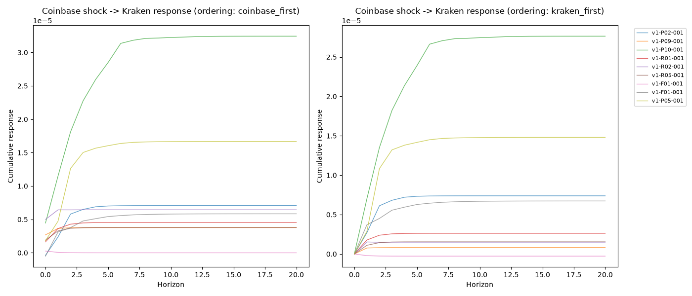
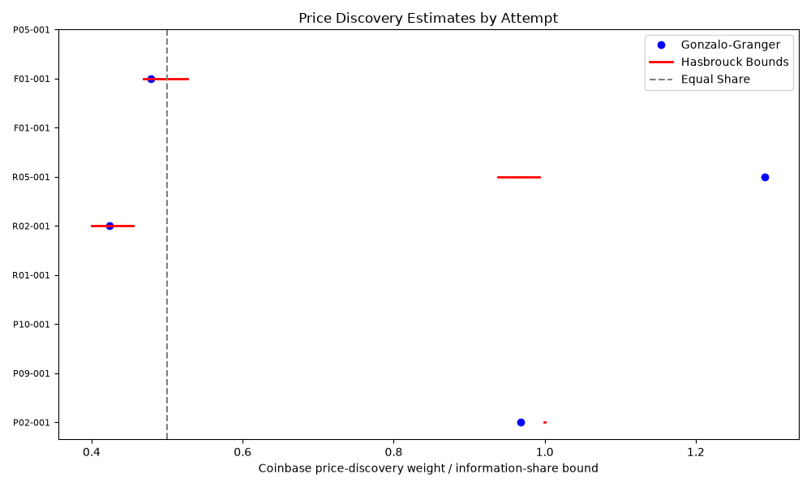

# BTC/USD Cross-Venue Price Discovery: Coinbase vs Kraken

[](https://github.com/AnshDani2004/cross-venue-price-discovery/actions/workflows/ci.yml)

An empirical market microstructure study of short-horizon information transmission between Coinbase and Kraken using synchronized BTC/USD trades and top-of-book data.

**Status:** Final confirmatory analysis complete. The repository includes the research pipeline, validation and econometric code, tests, audit documentation, and the deterministic FINAL reporting bundle.

## Research question

When BTC/USD prices move across Coinbase and Kraken, which venue tends to incorporate information first, and is that leadership stable across sessions?

The study separates short-horizon directional predictability from long-run price discovery. It uses a pre-specified, phase-gated workflow designed to reduce lookahead, data-quality leakage, and post-hoc specification changes.

## Main finding

Across 9 econometrically usable sessions, **Coinbase exhibits stronger and more persistent short-horizon price leadership over Kraken**. Kraken-to-Coinbase feedback appears in isolated periods, but the reverse-direction evidence is materially weaker in the one-step predictive regressions.

Long-run price-discovery leadership is more heterogeneous. Only 4 of the 9 usable sessions satisfy the frozen rank-one cointegration requirement for VECM-based Gonzalo-Granger and Hasbrouck analysis, and those sessions do not support a claim that Coinbase universally or permanently dominates price discovery.

These results measure directional predictability and price discovery. They do **not** establish structural causation or direct tradability.

## Key results

| Evidence                                    | Coinbase predicts Kraken | Kraken predicts Coinbase |
| ------------------------------------------- | -----------------------: | -----------------------: |
| Econometrically usable sessions             |                        9 |                        9 |
| BH-significant Granger sessions             |                **6 / 9** |                    1 / 9 |
| Aggregate Granger p-value                   |         **1.42175e-264** |              0.000704991 |
| Positive one-step predictive coefficients   |                **8 / 9** |                    7 / 9 |
| Aggregate HAC predictive-regression p-value |           **4.2899e-16** |                0.0904574 |

Additional evidence:

* A fixed economic Coinbase shock produces a positive terminal Kraken response in **8 of 9** usable sessions under both tested Cholesky orderings.
* Johansen cointegration ranks across the 9 usable sessions are: rank 0 in 2 sessions, rank 1 in 4 sessions, and rank 2 in 3 sessions.
* Gonzalo-Granger and Hasbrouck measures are reported only for the 4 rank-one sessions.
* The long-run measures are session-dependent rather than structurally fixed.

Aggregate inference uses Fisher combination of raw per-attempt p-values under the frozen methodology. Aggregate significance should be interpreted alongside the per-session results.

## Results at a glance

### Directional Granger predictability



### Coinbase shock to Kraken: impulse responses



### Long-run price discovery



The complete result package, including deterministic Parquet tables, browser-friendly CSV exports, figures, provenance identifiers, hashes, and interpretation notes, is available in [`results/final/`](results/final/).

## Dataset

The confirmatory dataset contains:

* **10 accepted paired collection attempts**
* **9 econometrically usable attempts**
* **18,571.366221 seconds** of authoritative paired overlap
* **18,528.188261 seconds** of empirical paired trade overlap
* synchronized BTC/USD public market data from Coinbase and Kraken

One accepted attempt is retained in the final dataset but fails the frozen minimum contiguous return-segment requirement for econometric estimation.

Raw market-data archives are intentionally not committed to Git. The repository contains the collection, archival, validation, normalization, and analysis code plus the compact FINAL result artifacts.

## Research design

The project uses a staged research process:

1. **Public data collection**
   Bounded Coinbase and Kraken WebSocket collectors capture trades and top-of-book information.

2. **Raw archival and validation**
   Exact raw frames are stored with manifests, checksums, timestamp diagnostics, continuity checks, recovery tooling, and explicit quality dispositions.

3. **Deterministic normalization**
   Accepted raw sessions are replayed into normalized analysis datasets with validation and provenance tracking.

4. **Synchronization and preliminary analysis**
   Cross-venue series are constructed with explicit timestamp discipline, staleness controls, gap handling, and no-lookahead checks.

5. **Frozen econometric analysis**
   Session-level and aggregate inference is computed only after methodology and configuration are fixed.

6. **Deterministic reporting**
   FINAL tables, figures, and the narrative report are generated with a manifest containing SHA-256 hashes and source identifiers.

The audit trail for these stages is preserved under [`docs/audits/`](docs/audits/).

## Econometric methodology

The final analysis includes:

* Augmented Dickey-Fuller stationarity diagnostics
* VAR lag selection using BIC with a frozen maximum lag
* bidirectional Granger-causality tests
* Benjamini-Hochberg multiple-testing correction
* one-step predictive regressions with HAC/Newey-West covariance
* Fisher aggregation of raw per-attempt p-values
* Johansen cointegration testing
* rank-one VECM estimation where supported
* Gonzalo-Granger permanent-component weights
* Hasbrouck information-share bounds under both Cholesky orderings
* impulse-response analysis under both orderings
* gap-safe sample construction and model-stability diagnostics

The baseline analysis uses a 100 ms sampling interval and a 100 ms return horizon. Methodological choices are frozen in [`configs/research/phase_04c_econometric_analysis.toml`](configs/research/phase_04c_econometric_analysis.toml).

## Long-run interpretation

The long-run results require special care.

Gonzalo-Granger outputs are **signed normalized permanent-component weights** and are not constrained to the interval from zero to one. They should not be interpreted mechanically as percentages.

Hasbrouck information shares are reported as ordering-dependent **bounds**. The frozen methodology does not insert an arbitrary point estimate between the lower and upper bounds.

Because only 4 sessions satisfy the rank-one requirement, the project treats long-run venue leadership as heterogeneous rather than universal.

## Robustness

The committed robustness artifact evaluates **VAR stability** across frozen alternative sampling, horizon, trimming, and ordering configurations.

It should not be interpreted as a comprehensive robustness test of every substantive price-leadership conclusion. The project deliberately distinguishes model-stability checks from broader economic robustness claims.

## Reproducibility

The project targets Python 3.12 or newer.

```bash
python3.12 -m venv .venv
source .venv/bin/activate
python -m pip install --upgrade pip
python -m pip install -e ".[dev]"
```

Run the local validation suite:

```bash
python -m ruff check .
python -m pytest -q tests/unit
```

The consolidated repository currently passes **481 unit tests**, with 3 additional local or live smoke tests skipped by default.

Common project checks are also available through:

```bash
make check
python -m cross_venue --help
python -m cross_venue --version
```

The exact FINAL generated reporting bundle is committed under [`results/final/generated/`](results/final/generated/). Its manifest records the reporting ID, source analysis result ID, dataset validation ID, source snapshot ID, deterministic content hash, and SHA-256 hashes for the generated report, figures, and Parquet tables.

The raw market-data archives and large local analysis datasets are not committed. Reproducing the exact empirical study from raw exchange messages therefore requires the corresponding source data, while the repository itself exposes the collection, validation, normalization, econometric, testing, and reporting implementation.

## Final result artifacts

Useful entry points:

* [`results/final/README.md`](results/final/README.md): interpretation guide and headline results
* [`results/final/generated/econometric_results_report.md`](results/final/generated/econometric_results_report.md): deterministic narrative report
* [`results/final/generated/tables/attempt_summary.md`](results/final/generated/tables/attempt_summary.md): compact session-level summary
* [`results/final/csv/aggregate_inference.csv`](results/final/csv/aggregate_inference.csv): aggregate inference
* [`results/final/csv/granger_results.csv`](results/final/csv/granger_results.csv): session-level Granger results
* [`results/final/csv/predictive_regressions.csv`](results/final/csv/predictive_regressions.csv): HAC predictive regressions
* [`results/final/csv/price_discovery_results.csv`](results/final/csv/price_discovery_results.csv): Gonzalo-Granger and Hasbrouck outputs
* [`results/final/generated/reporting_manifest.json`](results/final/generated/reporting_manifest.json): deterministic provenance and hashes

## Repository structure

```text
configs/        Frozen project, venue, data-quality, normalization, campaign, and research configuration
data/           Ignored raw and normalized data areas plus tiny public placeholders or samples
docs/           Architecture, research protocol, limitations, audit reports, and walkthroughs
notebooks/      Exploratory and report notebook area
reports/        Local generated-report workspace
results/final/  Compact public FINAL result bundle and browser-friendly exports
scripts/        Command wrappers and project utilities
src/            Reusable Python package
tests/          Unit, integration, property, regression, and opt-in smoke tests
```

## Engineering and research safeguards

The repository includes:

* explicit collector lifecycle state machines
* bounded public WebSocket collection
* raw-frame archival with SHA-256 sidecars
* persistent session manifests
* recovery and validation tooling
* quality-policy calibration and acceptance gates
* deterministic normalization
* source snapshotting and provenance identifiers
* no-lookahead synchronization checks
* frozen analysis configuration
* fail-closed FINAL reporting gates
* deterministic artifact hashing
* extensive unit and regression tests

## Limitations

This is a finite-sample study of BTC/USD on two spot venues over a limited set of collection sessions.

The findings should not be generalized automatically to:

* other assets or venues
* perpetual futures or derivatives
* all volatility or liquidity regimes
* future market structure
* executable trading profitability

Granger causality is used in its econometric sense of incremental temporal predictability. It does not establish structural, physical, or economic causation.

Observed lead-lag relationships are not assumed to remain profitable after fees, spreads, latency, queue position, market impact, fill uncertainty, and adverse selection.

## No live trading

This repository does not submit real orders, cancel real orders, transfer funds, manage live positions, or require private trading credentials.

The live components are limited to bounded **public market-data collection**. Execution research, if added, must remain simulated.

## Documentation

Core documentation includes:

* [`docs/research_protocol.md`](docs/research_protocol.md)
* [`docs/timestamp_policy.md`](docs/timestamp_policy.md)
* [`docs/data_dictionary.md`](docs/data_dictionary.md)
* [`docs/limitations.md`](docs/limitations.md)
* [`docs/architecture.md`](docs/architecture.md)
* [`docs/research/phase_04_finalization_repair.md`](docs/research/phase_04_finalization_repair.md)
* [`docs/audits/`](docs/audits/)

## License

MIT License. See [`LICENSE`](LICENSE).

---

Built as a reproducible quantitative research project focused on market microstructure, cross-venue information transmission, and disciplined empirical inference.
