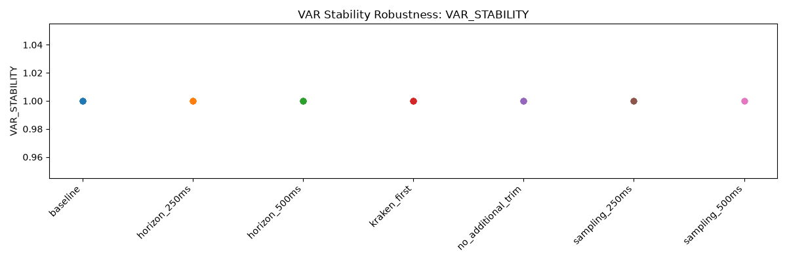

# Econometric Results Report

## 1. Dataset and inference status

The dataset satisfies final composite requirements and final inference is permitted.

- Dataset Validation ID: `validation-report-f62c52f63e66d45b`
- Source analysis result ID: `9b9a99c19105811c`
- Total accepted attempts: 10
- Econometrically usable attempts: 9
- Authoritative paired overlap, seconds: 18571.366221
- Empirical paired overlap, seconds: 18528.188261

## 2. Aggregate directional inference

Aggregate inference uses Fisher combination of raw per-attempt p-values under the frozen Phase 4C policy. These statistics measure directional predictability, not structural or economic causation.

| Analysis | Direction | Contributing attempts | Combined p-value | Status |
|---|---|---:|---:|---|
| Granger causality | Coinbase predicts Kraken | 9 | 1.42175e-264 | COMPUTED |
| Granger causality | Kraken predicts Coinbase | 9 | 0.000704991 | COMPUTED |
| One-step HAC predictive regression | Coinbase predicts Kraken | 9 | 4.2899e-16 | COMPUTED |
| One-step HAC predictive regression | Kraken predicts Coinbase | 9 | 0.0904574 | COMPUTED |

The per-attempt Granger results remain important for evaluating consistency across sessions; an aggregate p-value must not be interpreted as evidence that every session exhibits the same directional relationship.

## 3. VAR and impulse-response diagnostics

The IRF figure holds the economic impulse fixed as a Coinbase shock followed by the Kraken response and reports that path under both Cholesky orderings.

## 4. Cointegration and VECM support

- Attempts supporting cointegration diagnostics: 9
- Attempts supporting rank-one VECM estimation: 4

Gonzalo-Granger and Hasbrouck measures are therefore reported only where the frozen rank-one requirement is satisfied.

## 5. Price-discovery measures

Gonzalo-Granger values are signed normalized permanent-component weights and are not constrained to the unit interval. Hasbrouck results are reported as Cholesky-ordering bounds; no methodology-frozen point estimate is inserted between those bounds.

## 6. Predictive regressions

Per-attempt one-step predictive regressions use the frozen HAC/Newey-West covariance specification. Individual-session coefficients and p-values are provided in the attempt summary table.

## 7. Robustness and model stability

The Phase 4C robustness artifact evaluates VAR stability across the frozen alternative sampling, horizon, trimming, and ordering configurations. It should not be interpreted as a robustness test of every substantive price-leadership conclusion. The figure displays per-attempt observations only; aggregate rows remain available in the underlying robustness table.

## 8. Limitations

Granger causality denotes incremental temporal predictability and does not by itself establish economic or structural causation. Price-discovery estimates are session-dependent, and rank-one cointegration is not supported in every usable attempt. Aggregate Fisher evidence should therefore be interpreted alongside the per-attempt results. 
